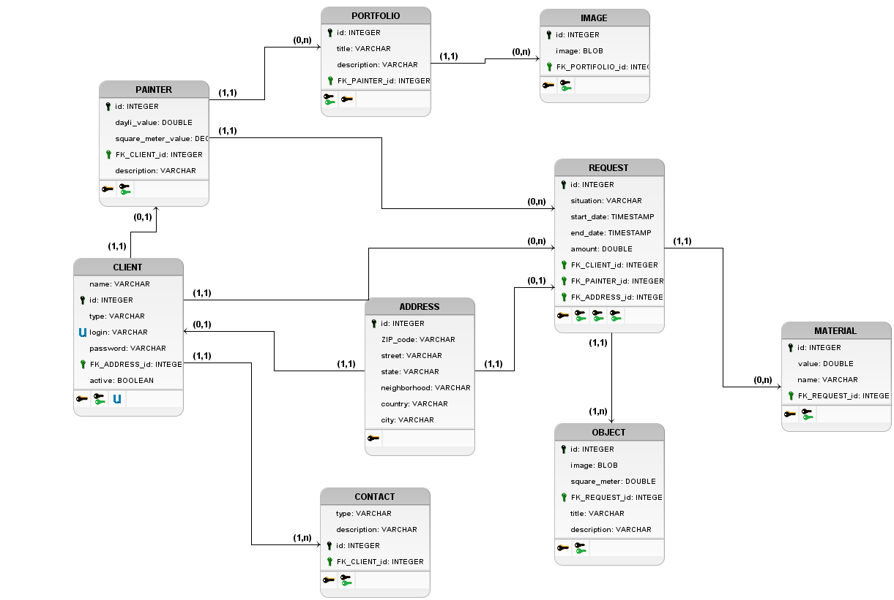

# Aplicação para solicitação de pintura

Sistema para solicitação de pinturas residencial / empresarial

<h2>Descrição</h2>

    O sistema tem como objetivo possibilitar a requisição de serviços de pintura e
    reparação a pintores da região. Dessa forma, clientes poderão entrar em contato com
    pintores para desde pintar paredes, até a pintura e reparação de moveis (através da pintura).
    Para tanto é possibilitado a clientes e pintores o cadastro e acesso ao sistema. Após logado
    clientes poderão manipular suas informações básicas, dados de acesso, endereço, e
    solicitações. Com foco nas solicitações, o cliente poderá visualizar seu histórico de
    solicitações concluídas, solicitações pondentes (que ainda não foram respondidas pelo pintor
    ou não confirmadas pelo cliente), como também, poderá iniciar uma nova solicitação, esta
    por sua vez consiste no processo de busca de um profissional e detalhamento do serviço a
    ser feito, mais especificamente as paredes ou moveis que serão pintados e suas respectivas
    cores, data e horário que deseja que o serviço seja realizado, como também endereço. Em
    relação ao pintor este poderá fazer tudo que o cliente faz, como também responder as
    solicitações a serviço, informando matérias necessários e assim confirmando que aparecerá.
    Desta forma o cliente poderá saber matérias e valor que será gasto para o serviço ser feito e
    responder ao pintor se está de acordo com os termos.

<h2>Diagrama</h2>

<h2>Ferramentas utilizadas</h2>
<ul>
	<li> Servidor php
		<ul>
			<li>Linguagem de programação PHP</li>
			<li>Framework php CodeIgniter v.3.1.11</li>
			<li>XAMPP </li>
			<li>brModelo para modelagem lógica/física</li>
			<li>Postman para testar requisições a API</li>
		</ul>
	</li>
	<li> Aplicação mobile
		<ul>
			<li>Linguagem de programação Dart</li>
			<li>Framework para o dart flutter</li>
			<li>Bibliotecas
				<ul>
					<li>animated_splash: ^1.0.0 Animação de inicalização</li>
					<li>bubble_bottom_bar: ^1.2.0 Para o dashboard</li>
					<li>datetime_picker_formfield: ^0.4.3 Selecção de data e hora</li>
					<li>multi_media_picker: ^0.2.3 para seleção de imagens do celular</li>
					<li>http: ^0.12.0+2 Para requisições a API</li>
				</ul>
			</li>	
		</ul>
	</li>
</ul>

<h2>Para execução da aplicação</h2>

Abaixo estão listados, ferramentas e configurações necessárias para a devida execução da aplicação.

<h3>Servidor</h3>
<h4>Pré-requisitos</h4>
<ul>
	<li>instalação do XAMPP, para criação do servidor( disponível em :https://www.apachefriends.org/pt_br/index.html).</li>
	<li>
	Criação do banco de dados  Mysql. Script para criação do banco está na pasta doc, no arquivo “SQL.sql”. O nome 
	do banco de dados deve ser “pinf” (já está configurado no sql, a criação do banco e tabelas, bastando apenas sua execução no SGBD).
	</li>
</ul>
<h3>Configurações</h3>
<ul>
	<li>
	Criar uma subpasta chamada “solicitar-pintura” dentro da pasta htdocs do xamp ; Baixar o código disponível aqui e extraí-lo na pasta criada anteriormente
	</li>
	<li>
	No servidor, através do framework codeigniter (se encontra na pasta “server” , sub-pasta de “solicitar-pintura”), é possibilitado a configuração de 
	parâmetros para acesso ao banco de dados como: nome de usuário do banco,  senha, nome do banco de dados, entre outros. Essas e outras configurações
	podem ser feitas no arquivo xampp\htdocs\solicitar-pintura\server\application\config\database.php. O usuário padrão é root, senha vazia e o banco 
	denominado “pinf”
	</li>
</ul>
<h3>Aplicação mobile</h3>
<h4>Pré-requisitos</h4>
<ul>
	<li>Instalar/configurar o flutter</li>
</ul>
<h3>Configurações</h3>
<ul>
	<li>Baixar as dependências do pubspec.</li>
	<li>Mudar o IP onde o servidor está  localizado na classe Entity, localizado no arquivo xampp\htdocs\solicitar-pintura\app\lib\src\model\Entity.dart</li>
</ul>

